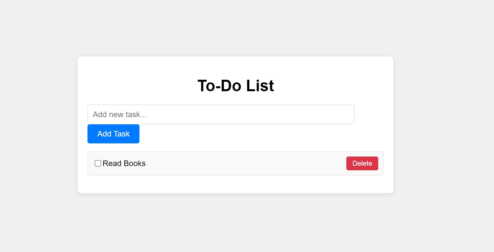

# CREATE A TO DO LIST

### AIM:

To Create a To-do List using HTML, CSS and Javascript.

### HTML:

      <!DOCTYPE html>
    <html lang="en">
      <head>
        <meta charset="UTF-8" />
        <meta name="viewport" content="width=device-width, initial-scale=1.0" />
        <title>To-Do List App</title>
        <link rel="stylesheet" href="assets/css/style.css" />
      </head>
      <body>
        

          <h1>To-Do List</h1>
          <input type="text" id="taskInput" placeholder="Add new task..." />
          <button id="addTask">Add Task</button>
          <ul id="taskList"></ul>
        

        
      </body>
    </html>

### CSS:

    body {
      font-family: Arial, sans-serif;
      background-color: #f0f0f0;
      margin: 0;
      padding: 0;
      display: flex;
      justify-content: center;
      align-items: center;
      height: 100vh;
    }
    .container {
      width: 80%;
      max-width: 600px;
      background-color: #fff;
      padding: 20px;
      border-radius: 8px;
      box-shadow: 0 2px 10px rgba(0, 0, 0, 0.1);
    }
    h1 {
      text-align: center;
      margin-bottom: 20px;
    }
    input[type="text"] {
      width: calc(100% - 80px);
      padding: 10px;
      font-size: 16px;
      border: 1px solid #ccc;
      border-radius: 4px;
      margin-right: 10px;
    }
    button {
      padding: 10px 20px;
      font-size: 16px;
      border: none;
      border-radius: 4px;
      background-color: #007bff;
      color: #fff;
      cursor: pointer;
    }
    button:hover {
      background-color: #0056b3;
    }
    ul {
      list-style-type: none;
      padding: 0;
    }
    li {
      display: flex;
      align-items: center;
      padding: 10px;
      margin-top: 10px;
      background-color: #f9f9f9;
      border: 1px solid #e0e0e0;
      border-radius: 4px;
    }
    li.completed {
      text-decoration: line-through;
      opacity: 0.6;
    }
    .deleteTask {
      margin-left: auto;
      padding: 6px 12px;
      font-size: 14px;
      background-color: #dc3545;
      color: #fff;
      border: none;
      border-radius: 4px;
      cursor: pointer;
    }
    .deleteTask:hover {
      background-color: #c82333;
    }

### JAVASCRIPT:

    const taskInput = document.getElementById("taskInput");
    const addTaskButton = document.getElementById("addTask");
    const taskList = document.getElementById("taskList");
    let tasks = [];

    // Function to render a task item
    function renderTask(task) {
      const taskItem = document.createElement("li");
      taskItem.setAttribute("data-id", task.id);
      taskItem.innerHTML = `
              <input type="checkbox" ${task.completed ? "checked" : ""}>
              ${task.text}
              <button class="deleteTask">Delete</button>
          `;
      taskList.appendChild(taskItem);

      // Add event listener for checkbox
      const checkbox = taskItem.querySelector('input[type="checkbox"]');
      checkbox.addEventListener("change", () => {
        task.completed = checkbox.checked;
        taskItem.classList.toggle("completed");
      });

      // Add event listener for delete button
      const deleteButton = taskItem.querySelector(".deleteTask");
      deleteButton.addEventListener("click", () => {
        tasks = tasks.filter((t) => t.id !== task.id);
        taskItem.remove();
      });
    }

    // Add event listener to add task button
    addTaskButton.addEventListener("click", () => {
      const taskText = taskInput.value.trim();
      if (taskText !== "") {
        const task = { id: Date.now(), text: taskText, completed: false };
        tasks.push(task);
        renderTask(task);
        taskInput.value = "";
      }
    });

    // Initialize the application
    function init() {
      // Load tasks from localStorage or initialize tasks array
      const tasksFromStorage = JSON.parse(localStorage.getItem("tasks"));
      if (tasksFromStorage) {
        tasks = tasksFromStorage;
        tasks.forEach((task) => renderTask(task));
      }
    }

    init();

    // Save tasks to localStorage on window unload
    window.addEventListener("unload", () => {
      localStorage.setItem("tasks", JSON.stringify(tasks));
    });

### OUTPUT:

### RESULT:

    Thus, the Todo list has been completed successfully using HTML, CSS and JS.
